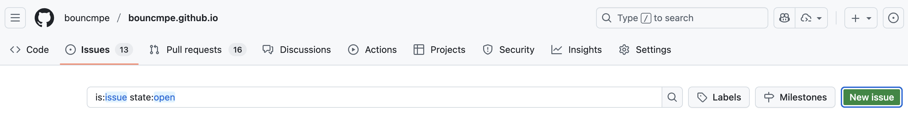
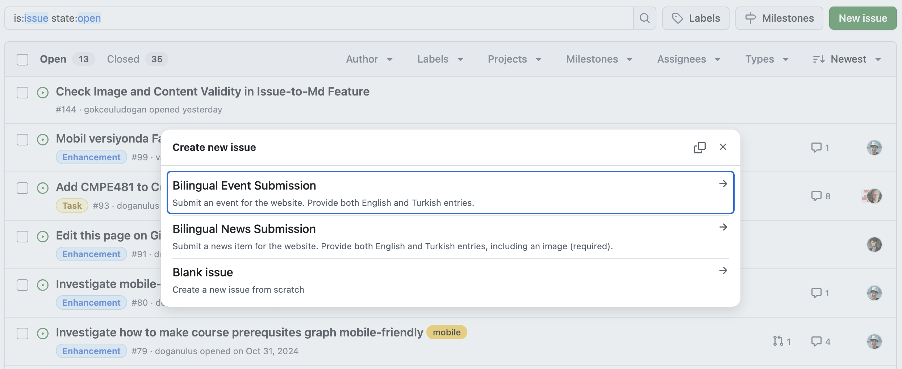
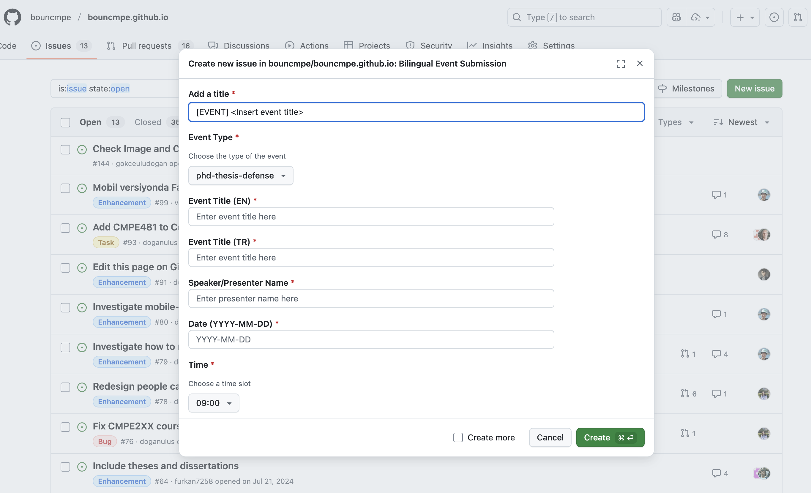
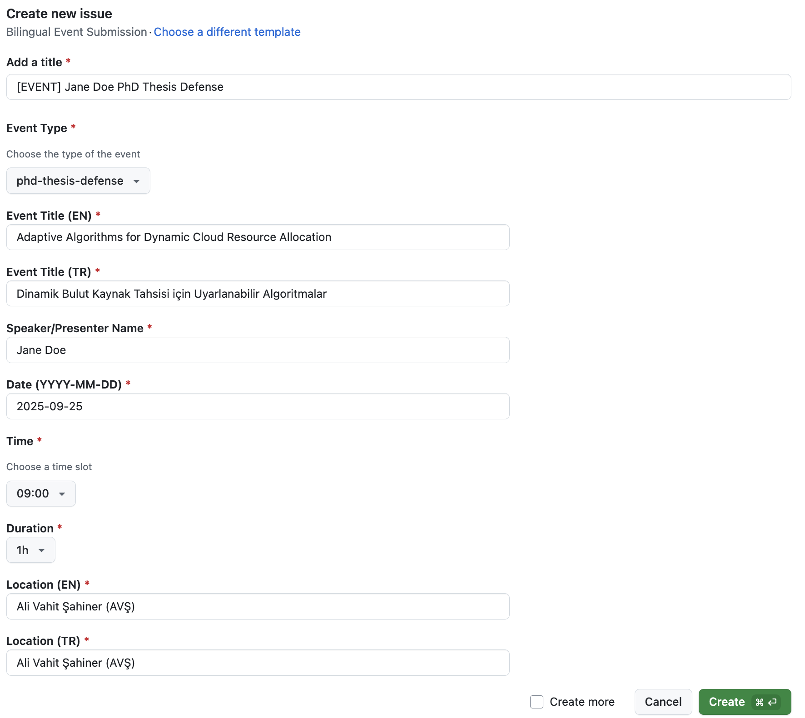
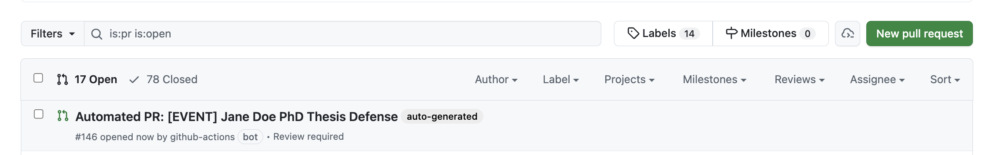
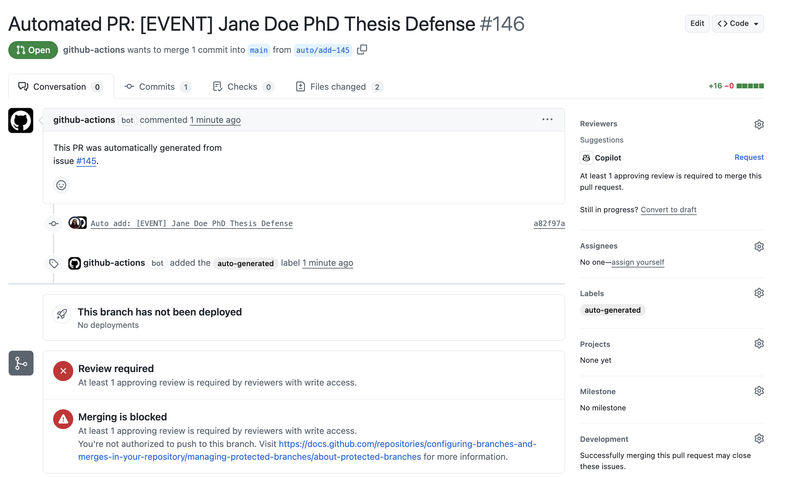
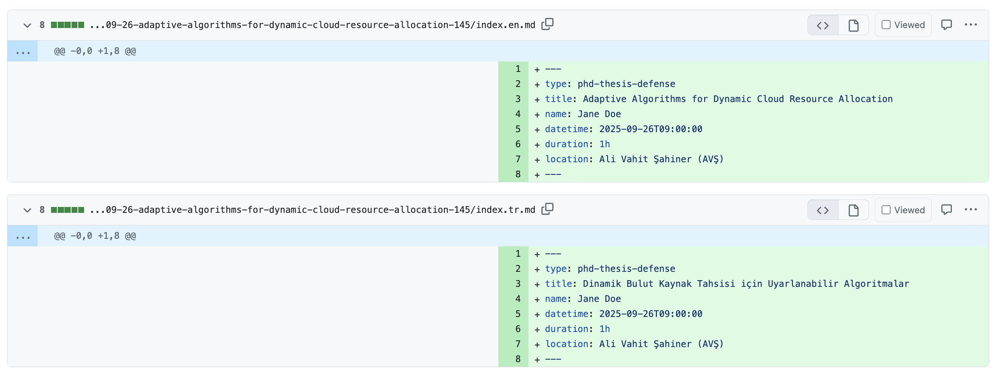
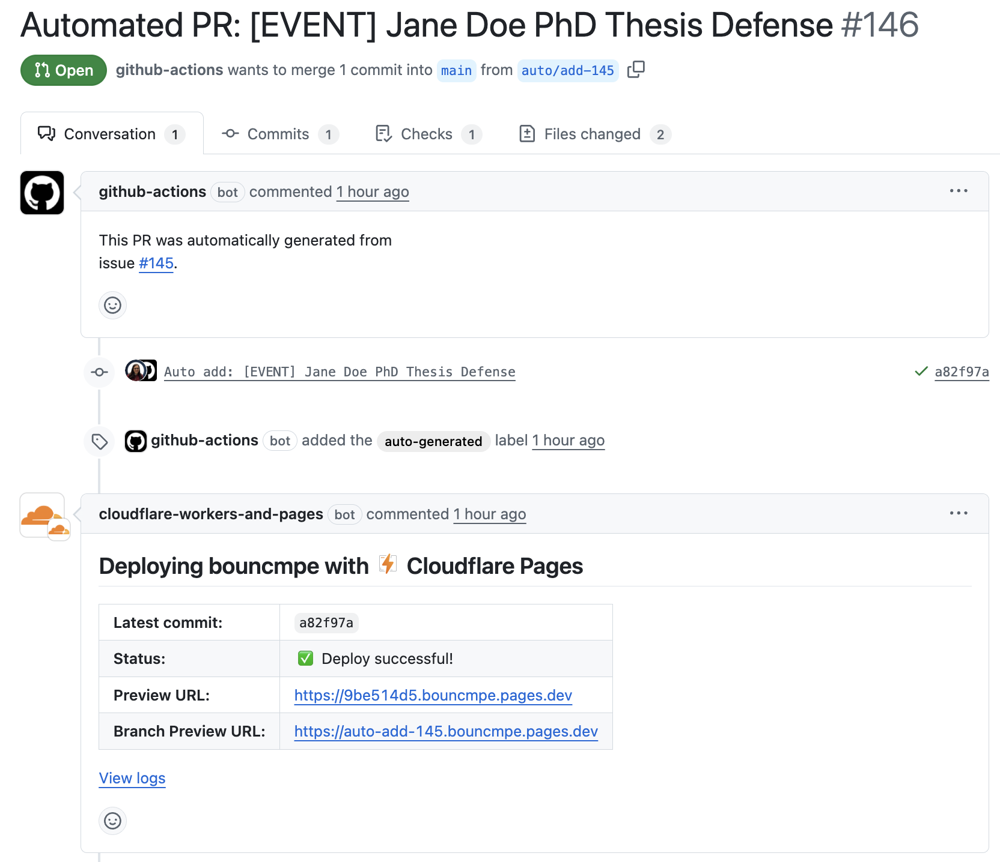

# Creating Event Content via Issue Automation

Our [website repository](https://github.com/bouncmpe/bouncmpe.github.io/) supports automated content creation for events and news items. Instead of manually editing Markdown files, contributors can submit structured information through GitHub Issues.
An automation pipeline will convert these issues into pull requests (PRs) that add the corresponding content.

This tutorial walks you through the process of creating **event content**.

## Create a New Issue

Navigate to the [Issues](https://github.com/bouncmpe/bouncmpe.github.io/issues) tab of the repository and click **New issue**.

## Choose the Appropriate Template

You will be prompted to choose between available templates.
There are dedicated templates for event and news submissions, which guide you to fill in the required information:

- **Bilingual Event Submission**
- **Bilingual News Submission**
- **Blank issue**

For events, choose **Bilingual Event Submission**.  
For news items, choose **Bilingual News Submission**.

## Fill in the Required Fields

Each template will display a form with required fields.

For events, you must provide:

- **Event Title (EN/TR)** – English and Turkish versions of the event title.
- **Event Type** – choose one of `phd-thesis-defense`, `ms-thesis-defense`, `seminar`, `special-event`.
- **Speaker/Presenter Name**.
- **Date** and **Time**.
- **Location (EN/TR)**.
- **Duration**.

All entries are **bilingual (EN/TR)**. Please provide both languages.

**Empty form**

**Example filled form**

Once done, click **Create**.

## Review the Generated Pull Request

After you submit the issue, the automation system will generate a PR with the corresponding Markdown files.

The PR will:

- Be titled `Automated PR: [EVENT] <Event Title>` (or `[NEWS]` for news).
- Contain the generated Markdown content in the correct folder.
- Be labeled **auto-generated**.

> **Real example:** See [Issue #145](https://github.com/bouncmpe/bouncmpe.github.io/issues/145) and the generated [PR #146](https://github.com/bouncmpe/bouncmpe.github.io/pull/146) for the full flow.

To inspect the generated content, open the **Files changed** tab in the PR and review the Markdown files.

Afterwards, a separate workflow will deploy the site. When the deployment completes, follow the preview URL in the PR checks and confirm everything looks correct on the deployed site.

After the PR is approved and merged, the event will appear on the live site.
<!--insert website screenshot-->

## Policy for Corrections

If you notice a mistake after submitting an issue:

- **Edit the original issue** directly.
- The automation will re-trigger and update the generated PR automatically.

You do **not** need to create a new issue for small fixes.
