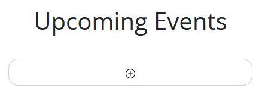
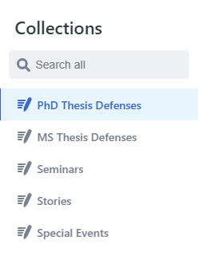
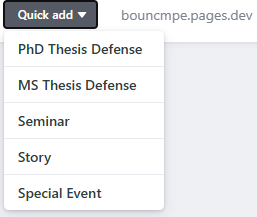
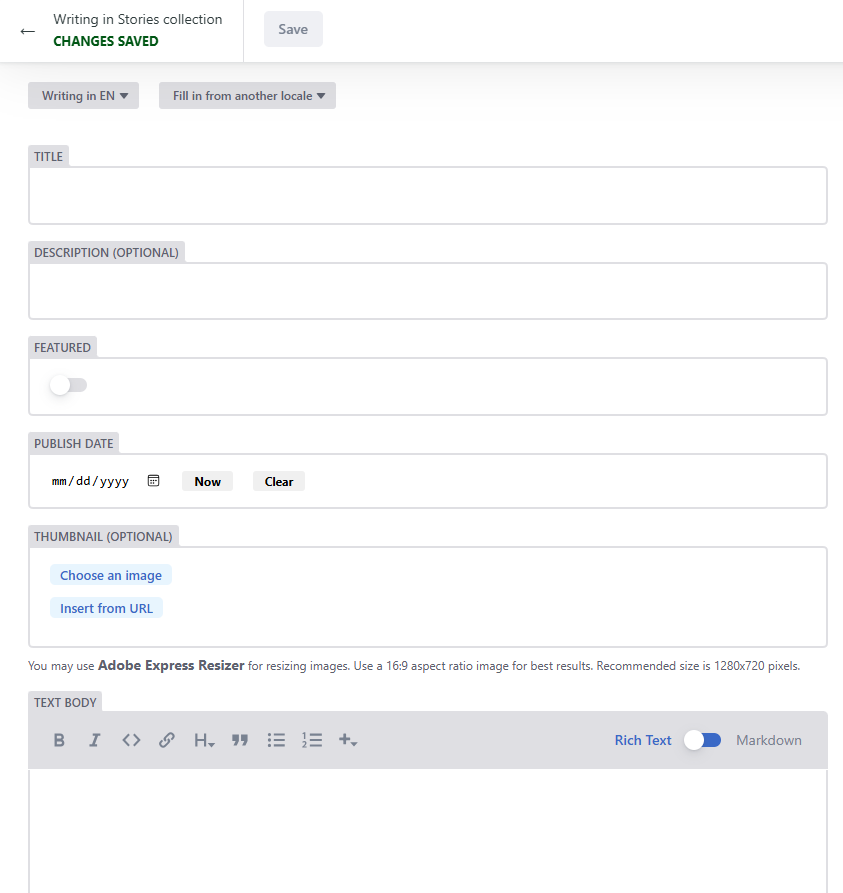

# Content Creation for the Website

To create an story that will be shown on our site you should follow these steps:

1. On the main page of [CMPE Website](https://cmpe.bogazici.edu.tr/), click the plus sign below the "Upcoming Events" title to the right or the plus sign below the stories.

2. After clicking the plus sign, the site will send you to [story creation interface](http://127.0.0.1:1313/admin). On this page select "Login with GitHub" and fill in your credentials.

3. On the opened page, you will see categories under "Collections" in the left sidebar. From there, choose the "story" category for your event. You can see examples of stories  on the main page of the [CMPE Website](https://cmpe.bogazici.edu.tr/). 

4. In your selected category find the "New Story" button. You can click there to go to your new story page.

5. Instead of steps 3 and 4, on the [story creation interface](http://127.0.0.1:1313/admin) main page you can see a button named "Quick Add" in the upper navigation bar. By choosing from the "story" from the same set of categories, you can directly go to your new content page.

6. On the new page, you can set the title, description, publish date, and body text in markdown style or rich text format. You can set a thumbnail photo for your story.

7. On the right, you can see a second content creation menu. Since our site supports both English and Turkish languages, in this second part you can write the Turkish translations of your story information. Through language selection on the website, you can select between two languages to see the difference.

8. After you fill in all necessary parts for your story, you can save your story as a draft and view it on the workflows page. You can reach the workflows page by going back to the previous page and choosing the relevant section from the upper menu.

9. If you have write access to the GitHub repository of the website, you can set the status for your story to "ready" and publish. If you do not, you can wait for someone with authorization to review your work and publish it. You can track the status of your story on the same "Workflows" page.

10. On the event creation or editing page, you will also see a button labeled "Delete published entry" at the top. This button allows you to delete the current entry from the workflow. If the entry is still a draft or unpublished, the button will appear as "Delete unpublished entry" instead. Be careful when using this button, as deletion will remove the entry permanently from the system.

To help you, you can check the other stories in "Story" category by choosing the relevant category from the "Collections" menu and clicking one of the titles listed. Also, you can check and use uploaded media through the "Media" section that is accessible from the upper menu on the main page.